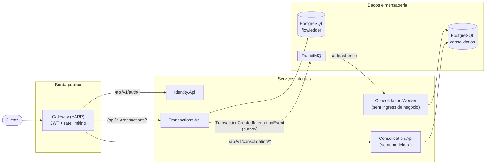
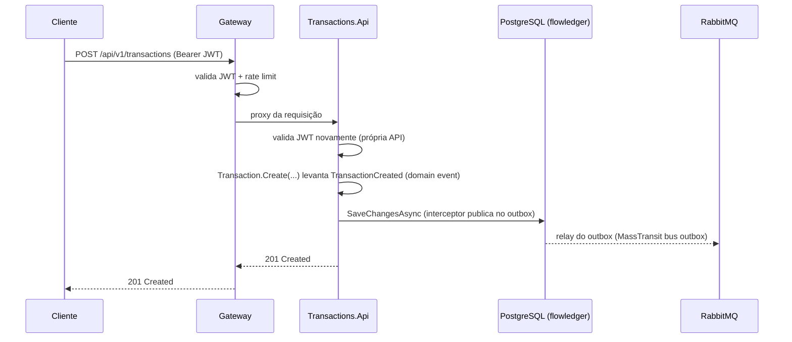
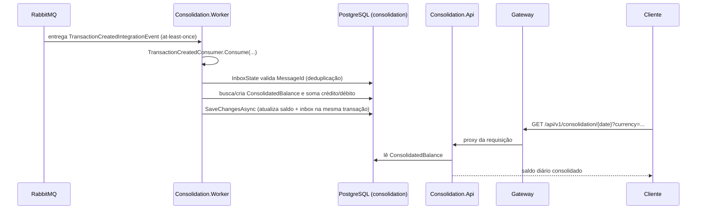

# FlowLedger

Plataforma de fluxo de caixa (cash flow) construída em .NET 10, organizada como um conjunto de serviços distribuídos que registram transações financeiras e produzem, de forma assíncrona, um saldo consolidado por comerciante/dia/moeda. O projeto foi desenhado para demonstrar, de ponta a ponta, decisões arquiteturais de um sistema distribuído real: mensageria confiável (outbox/inbox), CQRS, segurança em camadas, observabilidade, orquestração local com .NET Aspire e deployment em Azure Container Apps.

> Este documento descreve **exclusivamente o que está implementado no código** deste repositório. Decisões arquiteturais mais detalhadas, com contexto, alternativas e trade-offs, estão registradas como Architecture Decision Records em [docs/adr](docs/adr).

## Sumário

1. [Visão geral](#1-visão-geral)
2. [Objetivo e contexto](#2-objetivo-e-contexto)
3. [Requisitos funcionais](#3-requisitos-funcionais)
4. [Arquitetura da solução](#4-arquitetura-da-solução)
5. [Diagrama de arquitetura](#5-diagrama-de-arquitetura)
6. [Responsabilidade de cada serviço](#6-responsabilidade-de-cada-serviço)
7. [Fluxo de criação de uma transação](#7-fluxo-de-criação-de-uma-transação)
8. [Fluxo de consolidação assíncrona](#8-fluxo-de-consolidação-assíncrona)
9. [Estratégia de consistência e mensageria](#9-estratégia-de-consistência-e-mensageria)
10. [CQRS](#10-cqrs)
11. [Outbox e entrega at-least-once](#11-outbox-e-entrega-at-least-once)
12. [Idempotência](#12-idempotência)
13. [Autenticação e autorização](#13-autenticação-e-autorização)
14. [Gateway e segurança de borda](#14-gateway-e-segurança-de-borda)
15. [Observabilidade](#15-observabilidade)
16. [Health checks e graceful shutdown](#16-health-checks-e-graceful-shutdown)
17. [Estratégia de persistência](#17-estratégia-de-persistência)
18. [Execução local com .NET Aspire](#18-execução-local-com-net-aspire)
19. [Testes](#19-testes)
20. [CI/CD](#20-cicd)
21. [Arquitetura de produção no Azure](#21-arquitetura-de-produção-no-azure)
22. [Configuração de secrets](#22-configuração-de-secrets)
23. [Decisões e trade-offs arquiteturais](#23-decisões-e-trade-offs-arquiteturais)
24. [Limitações e itens fora de escopo](#24-limitações-e-itens-fora-de-escopo)
25. [Como executar e validar manualmente](#25-como-executar-e-validar-manualmente)

---

## 1. Visão geral

FlowLedger é composto por 5 serviços executáveis (`Gateway`, `Identity.Api`, `Transactions.Api`, `Consolidation.Api`, `Consolidation.Worker`), uma biblioteca de contratos compartilhados (`Contracts`) e uma biblioteca de defaults de observabilidade/resiliência (`ServiceDefaults`). A orquestração — local e de publicação — é feita por um `AppHost` do .NET Aspire.

A escrita (criação de transações) e a leitura consolidada (saldo diário) são propositalmente separadas em serviços diferentes, conectados por mensageria assíncrona (RabbitMQ via MassTransit), e não por chamadas síncronas entre si.

## 2. Objetivo e contexto

O repositório implementa um desafio técnico de plataforma de fluxo de caixa, com foco em:

- Registrar transações financeiras (crédito/débito) por comerciante.
- Consolidar, de forma assíncrona e resiliente, o saldo diário por comerciante/moeda.
- Expor essas capacidades atrás de um único ponto de entrada autenticado.
- Demonstrar práticas de arquitetura distribuída prontas para operação (health checks, graceful shutdown, observabilidade, CI/CD e deployment em nuvem), dentro do escopo que foi efetivamente implementado.

## 3. Requisitos funcionais

Com base nos endpoints e no domínio implementados:

- **Autenticação**: `POST /api/v1/auth/login` autentica um usuário (username/senha) e emite um JWT.
- **Criação de transação**: `POST /api/v1/transactions` registra uma transação de crédito ou débito para o comerciante autenticado (identificado pela claim `merchantId` do próprio JWT).
- **Consulta de transação**: `GET /api/v1/transactions/{id}` retorna uma transação específica do comerciante autenticado.
- **Consulta de saldo consolidado**: `GET /api/v1/consolidation/{date}?currency={currency}` retorna o saldo diário (créditos, débitos, saldo líquido) do comerciante autenticado para uma data e moeda.

Não há endpoints de cadastro/gestão de usuários, de listagem de transações, de estorno/edição, nem de consolidação multi-moeda — apenas o que está descrito acima existe no código.

## 4. Arquitetura da solução

A solução segue uma arquitetura de **microsserviços orientados a mensagens**, com separação clara entre o lado de escrita (Transactions) e o lado de leitura consolidada (Consolidation), comunicando-se via eventos de integração — nunca por chamada HTTP direta entre si.

Serviços e biblioteca:

| Projeto | Tipo | Papel |
|---|---|---|
| `FlowLedger.Gateway` | ASP.NET Core + YARP | Único ponto de entrada público; autenticação, rate limiting, roteamento |
| `FlowLedger.Identity.Api` | ASP.NET Core Minimal API | Autenticação e emissão de JWT |
| `FlowLedger.Transactions.Api` | ASP.NET Core Minimal API | Escrita de transações; publica eventos de integração |
| `FlowLedger.Consolidation.Worker` | ASP.NET Core (sem superfície HTTP de negócio) | Consome eventos e atualiza o saldo consolidado |
| `FlowLedger.Consolidation.Api` | ASP.NET Core Minimal API | Leitura do saldo consolidado (somente leitura) |
| `FlowLedger.Contracts` | Biblioteca de classes | Contratos de eventos de integração compartilhados entre produtor e consumidor |
| `FlowLedger.ServiceDefaults` | Biblioteca de classes | OpenTelemetry, health checks, resiliência HTTP e service discovery, compartilhados por todos os serviços |
| `FlowLedger.AppHost` | .NET Aspire AppHost | Orquestração local e definição do modelo de publicação em Azure Container Apps |

Cada serviço HTTP referencia `FlowLedger.ServiceDefaults` para herdar telemetria e health checks padronizados (`AddServiceDefaults()` / `MapDefaultEndpoints()`).

## 5. Diagrama de arquitetura



Este é o único diagrama de arquitetura geral do repositório; os fluxos das seções 7 e 8 detalham a ordem temporal das interações.

## 6. Responsabilidade de cada serviço

- **Gateway**: único serviço com ingress público (`WithExternalHttpEndpoints()`). Valida o JWT, aplica rate limiting, aplica cabeçalhos de segurança e faz proxy reverso (YARP) para `identity-api`, `transactions-api` e `consolidation-api`. Não possui lógica de negócio.
- **Identity.Api**: autentica usuários contra um `InMemoryUserStore` (ver seção 24) e emite JWT assinado com HMAC-SHA a partir de um segredo compartilhado. Não persiste em banco de dados.
- **Transactions.Api**: dono do domínio `Transaction`. Valida e persiste transações, gera o evento de domínio `TransactionCreated` e o traduz em evento de integração publicado via outbox transacional.
- **Consolidation.Worker**: consome `TransactionCreatedIntegrationEvent`, atualiza o `ConsolidatedBalance` (créditos/débitos por comerciante/data/moeda) no banco `consolidation`. Não expõe endpoints de negócio via HTTP — apenas os endpoints de health check herdados de `ServiceDefaults`.
- **Consolidation.Api**: expõe a leitura do saldo consolidado. Reutiliza diretamente o `ConsolidationDbContext` definido no projeto `Consolidation.Worker` (referência de projeto), não possuindo modelo de dados próprio nem consumindo mensagens.
- **Contracts**: define os contratos de eventos de integração (`IIntegrationEvent`, `IntegrationEvent`, `TransactionCreatedIntegrationEvent`) usados como "linguagem comum" entre `Transactions.Api` (produtor) e `Consolidation.Worker` (consumidor), independente dos modelos de domínio internos de cada serviço.
- **ServiceDefaults**: configura OpenTelemetry (traces/métricas/logs), health checks padrão (`/health`, `/alive`), output caching e request timeout para os endpoints de health, resiliência HTTP padrão e service discovery — usados por todos os serviços ASP.NET Core da solução.

## 7. Fluxo de criação de uma transação



Pontos relevantes do código:

- `TransactionsEndpoints.MapTransactionsEndpoints` exige autenticação (`RequireAuthorization()`) e extrai o `merchantId` da claim do JWT — o comerciante nunca é informado livremente pelo cliente na URL/corpo.
- `Transaction.Create` valida invariantes de domínio (valor > 0, moeda obrigatória, descrição obrigatória etc.) e levanta o evento de domínio `TransactionCreated`.
- `DomainEventInterceptor` (um `SaveChangesInterceptor` do EF Core) é acionado dentro do próprio `SaveChangesAsync`: ele varre as entidades `Transaction` rastreadas com eventos pendentes, mapeia cada `TransactionCreated` para um `TransactionCreatedIntegrationEvent` (via `IntegrationEventMapper`) e publica via `IPublishEndpoint`. Como o outbox do MassTransit está habilitado (`UseBusOutbox()`), essa publicação é gravada na mesma transação de banco, e não enviada diretamente ao broker.

## 8. Fluxo de consolidação assíncrona



O `TransactionCreatedConsumer` busca (ou cria) um `ConsolidatedBalance` pela chave (`MerchantId`, `ReferenceDate`, `Currency`), soma o valor em `TotalCredits` ou `TotalDebits` conforme o tipo da transação, e persiste com um único `SaveChangesAsync`. A leitura pelo cliente é sempre eventual: não há nenhum mecanismo síncrono que force a consolidação antes da resposta de criação da transação.

## 9. Estratégia de consistência e mensageria

O sistema adota **consistência eventual** entre a escrita (Transactions.Api) e a leitura consolidada (Consolidation.Worker/Api), conectadas exclusivamente por mensageria assíncrona via **RabbitMQ** com **MassTransit** como biblioteca de abstração de bus.

- `Transactions.Api` é produtor: publica `TransactionCreatedIntegrationEvent` através de um outbox transacional (`AddEntityFrameworkOutbox<TransactionsDbContext>` + `UseBusOutbox()`).
- `Consolidation.Worker` é consumidor: assina a fila `consolidation-transaction-created`, com retry exponencial configurado explicitamente (`UseMessageRetry(r => r.Exponential(retryLimit: 5, minInterval: 1s, maxInterval: 30s, intervalDelta: 5s))`) e outbox/inbox transacional próprio na recepção (`UseEntityFrameworkOutbox<ConsolidationDbContext>`).
- Não há comunicação HTTP síncrona entre `Transactions.Api` e o lado de consolidação — o único acoplamento é o contrato de evento em `FlowLedger.Contracts`.
- `Consolidation.Api` não participa da mensageria: é puramente um leitor do banco `consolidation` populado pelo Worker.

## 10. CQRS

Cada serviço com lógica de negócio separa fisicamente comandos e queries em pastas `Application/Commands/<Nome>` e `Application/Queries/<Nome>`, cada uma com seu próprio *handler* (classe simples, sem biblioteca de mediator como MediatR):

- `Transactions.Api`: `Application/Commands/CreateTransaction/CreateTransactionHandler` (escreve) e `Application/Queries/GetTransaction/GetTransactionHandler` (lê), ambos injetados diretamente nos Minimal API endpoints.
- `Consolidation.Api`: `Application/Queries/GetDailyBalance/GetDailyBalanceHandler` — não existe lado de escrita neste serviço.
- `Identity.Api`: `Application/Commands/Login/LoginHandler`.

O CQRS aqui é uma separação de responsabilidade por pasta/handler dentro do mesmo processo, não uma infraestrutura de CQRS com barramento de comandos/queries. Em um nível mais amplo, a separação entre `Transactions.Api` (escrita) e `Consolidation.Api`/`Consolidation.Worker` (leitura consolidada) também é, na prática, uma separação command/query entre serviços, conectada por eventos.

## 11. Outbox e entrega at-least-once

O padrão **Transactional Outbox** do MassTransit (`AddEntityFrameworkOutbox`) é usado nas duas pontas da mensageria, com propósitos distintos:

- **Lado produtor (`Transactions.Api`)**: `o.UsePostgres(); o.UseBusOutbox();` — qualquer `Publish` feito dentro de uma transação do `TransactionsDbContext` é gravado na tabela de outbox como parte do mesmo `SaveChangesAsync`, e só é efetivamente entregue ao RabbitMQ depois que o commit é bem-sucedido. Isso garante que o evento nunca é perdido nem publicado "adiantado" em caso de falha na gravação da transação.
- **Lado consumidor (`Consolidation.Worker`)**: `o.UsePostgres();` (sem `UseBusOutbox()`), combinado com `e.UseEntityFrameworkOutbox<ConsolidationDbContext>(context)` no *receive endpoint* — isso cria também uma tabela `InboxState`, usada para deduplicação de mensagens recebidas (ver seção 12).

Como o RabbitMQ garante apenas entrega **at-least-once** (a mesma mensagem pode ser reentregue após timeout de ack, falha de rede etc.), o consumidor precisa ser preparado para reprocessar mensagens — o que é resolvido pelo inbox descrito a seguir.

## 12. Idempotência

A idempotência do lado consumidor é garantida pelo **Inbox Pattern do MassTransit** (tabela `InboxState`, com chave única `MessageId` + `ConsumerId`), habilitado automaticamente pelo `UseEntityFrameworkOutbox<ConsolidationDbContext>` no *receive endpoint* do `Consolidation.Worker`. Quando uma mensagem com o mesmo `MessageId` é entregue novamente, o MassTransit identifica a duplicata via o `InboxState` e evita executar o consumer novamente, prevenindo dupla contabilização do saldo.

Isso é validado por um teste de integração real (`tests/FlowLedger.Consolidation.IntegrationTests/TransactionCreatedFlowTests.cs`, teste `Publish_SameEventTwice_InboxDeduplicatesAndBalanceIsNotDoubled`), que publica o mesmo evento duas vezes contra um RabbitMQ/Postgres reais (via Testcontainers) e confirma que o saldo não é somado em duplicidade.

O `MessageId` publicado é o `EventId` do próprio evento de integração (`context.MessageId = integrationEvent.EventId`), definido no momento da criação do evento em `IntegrationEventMapper`/`DomainEventInterceptor` — ou seja, a idempotência depende de o produtor gerar um `EventId` estável por evento de domínio (o que ocorre, pois cada `TransactionCreated` gera um único evento de integração com `EventId` próprio).

## 13. Autenticação e autorização

- **Emissão**: `Identity.Api` autentica usuário/senha (hash via `Microsoft.AspNetCore.Identity.PasswordHasher<User>`) contra um `InMemoryUserStore` e emite um JWT (`JwtTokenGenerator`) contendo, entre outras claims, `merchantId`.
- **Segredo compartilhado**: a chave de assinatura (`Jwt:SigningKey`) é simétrica (HMAC) e compartilhada, via configuração, entre `Identity.Api` (emissor), `Gateway`, `Transactions.Api` e `Consolidation.Api` (validadores).
- **Validação em camadas**: o JWT é validado **duas vezes** para as rotas protegidas — primeiro no `Gateway` (que já exige um usuário autenticado antes de fazer o proxy) e novamente em cada API de destino (`Transactions.Api`, `Consolidation.Api`), que também configuram seu próprio `AddJwtBearer` e `RequireAuthorization()`. Não há relação de confiança implícita entre Gateway e serviços internos — cada serviço valida o token de forma independente.
- **Autorização por claim**: não há políticas de autorização baseadas em roles/scopes — a única regra de autorização de negócio é a extração do `merchantId` da claim do próprio usuário autenticado, usada para restringir os dados retornados/criados àquele comerciante.

## 14. Gateway e segurança de borda

O `Gateway` é o único componente com ingress externo (`WithExternalHttpEndpoints()` no AppHost) e concentra as seguintes proteções:

- **Roteamento YARP** com 3 rotas explícitas: `/api/v1/auth/**` → `identity-cluster`, `/api/v1/transactions/**` → `transactions-cluster`, `/api/v1/consolidation/**` → `consolidation-cluster`. Não existe rota "catch-all" — caminhos não mapeados não são propagados a nenhum serviço interno.
- **Política de autorização por rota**: `AuthorizationPolicy: "Anonymous"` na rota de login (valor reservado do YARP para dispensar autenticação) e `AuthorizationPolicy: "default"` nas rotas de transações/consolidação (valor reservado do YARP que exige um usuário autenticado, sem necessidade de política nomeada adicional).
- **Rate limiting** (`System.Threading.RateLimiting`, fixed window, por IP remoto): limite global de **100 requisições / 10s**; política `auth` mais restritiva de **5 requisições / minuto** aplicada especificamente à rota de login. Excesso responde `429 Too Many Requests`.
- **Cabeçalhos de segurança** aplicados a toda resposta: `X-Content-Type-Options: nosniff`, `X-Frame-Options: DENY`, `Referrer-Policy: no-referrer`.
- **HSTS/HTTPS redirect condicionais**: aplicados a todas as rotas, exceto `/health` e `/alive` — essa exclusão existe porque, no Azure Container Apps, os probes de liveness/readiness acessam o container diretamente (sem passar pelo TLS termination do ingress) e não enviam `X-Forwarded-Proto`, o que faria o redirect/HSTS falhar os probes.
- **Forwarded headers**: `X-Forwarded-For`/`X-Forwarded-Proto` são processados (necessário atrás do ingress do Container Apps), com `KnownIPNetworks`/`KnownProxies` explicitamente limpos.

## 15. Observabilidade

Toda a observabilidade é centralizada em `FlowLedger.ServiceDefaults` e herdada por todos os serviços via `AddServiceDefaults()`:

- **Tracing**: OpenTelemetry com instrumentação de ASP.NET Core e HttpClient, mais as fontes customizadas `MassTransit` e `Npgsql` — ou seja, chamadas HTTP, operações de banco (Npgsql) e mensageria (MassTransit) aparecem no mesmo trace. Requisições para `/health` e `/alive` são explicitamente filtradas do tracing para reduzir ruído.
- **Métricas**: instrumentação de ASP.NET Core, HttpClient e runtime, mais os *meters* customizados `MassTransit` e o meter da própria aplicação (`builder.Environment.ApplicationName`). Além disso, `Transactions.Api` e `Consolidation.Worker` publicam contadores de negócio próprios (`flowledger.transactions.created`, `flowledger.consolidation.messages_processed`, com dimensões por moeda/tipo).
- **Exportação**: um exportador OTLP é habilitado condicionalmente, apenas quando a variável de ambiente `OTEL_EXPORTER_OTLP_ENDPOINT` está definida (por exemplo, ao rodar via o dashboard do .NET Aspire, que injeta essa variável automaticamente).
- **Logs**: OpenTelemetry Logging habilitado com mensagens formatadas e escopos incluídos (`IncludeFormattedMessage`, `IncludeScopes`).

## 16. Health checks e graceful shutdown

**Health checks** (`ServiceDefaults.AddDefaultHealthChecks`/`MapDefaultEndpoints`):

- `/health` (readiness): executa **todos** os health checks registrados. Protegido por output cache (10s) e request timeout (5s) para reduzir carga de probes frequentes.
- `/alive` (liveness): executa apenas os checks marcados com a tag `"live"` — por padrão, somente o check fixo `"self"` (sempre saudável). Isso evita que uma dependência externa indisponível (banco, broker) derrube o container por falha de liveness, reservando esse sinal apenas para "o processo está travado/não responde".
- Checks adicionais registrados por serviço: `AddDbContextCheck` (tag `"ready"`) em `Transactions.Api`, `Consolidation.Api` e `Consolidation.Worker`; o `BusHealthCheck` do MassTransit (tags `"ready"`, `"masstransit"`) é registrado automaticamente onde há `AddMassTransit` (`Transactions.Api`, `Consolidation.Worker`), sem configuração adicional.
- `Consolidation.Worker` é hospedado como `WebApplication` (SDK `Microsoft.NET.Sdk.Web`), e não como Worker Service genérico, unicamente para poder expor `/health`/`/alive` via HTTP para os probes do ACA — ele não possui nenhum endpoint de negócio.

**Graceful shutdown**: não há código customizado de shutdown — o comportamento depende inteiramente dos mecanismos nativos do .NET Generic Host (drenagem de conexões Kestrel, `HostOptions.ShutdownTimeout` padrão de 30s) e da integração do MassTransit com `IHostApplicationLifetime` (para de consumir e drena mensagens em processamento antes de finalizar). O único ajuste explícito no código é, no modelo de publicação para Azure Container Apps (`AppHost.cs`), a configuração de `app.Template.TerminationGracePeriodSeconds = 45` — maior que o timeout padrão do host — para evitar que o ACA envie `SIGKILL` antes do host terminar o shutdown gracioso.

Probes HTTP do ACA configurados explicitamente em `AppHost.cs` (`ConfigureHealthProbes`): liveness em `/alive` (delay inicial 10s, período 15s, timeout 5s, 3 falhas para reiniciar) e readiness em `/health` (delay inicial 5s, período 10s, timeout 5s, 3 falhas para remover do balanceamento).

## 17. Estratégia de persistência

- **PostgreSQL** via EF Core (Npgsql) é o único banco de dados usado no projeto.
- **Banco por bounded context**: `flowledger` (propriedade de `Transactions.Api`) e `consolidation` (propriedade de `Consolidation.Worker`, lido também por `Consolidation.Api`) são bancos lógicos distintos no mesmo servidor Postgres — não há um banco único compartilhado por todos os serviços.
- **`Consolidation.Api` não possui `DbContext` próprio**: ele referencia o projeto `Consolidation.Worker` e reutiliza diretamente a classe `ConsolidationDbContext` definida lá. Isso significa que o serviço de leitura depende, em tempo de compilação, do assembly do serviço que escreve os dados — não há uma biblioteca de modelo de leitura verdadeiramente independente (ver inconsistência reportada ao final da tarefa).
- **Migrações EF Core** existem para `Transactions.Api` e `Consolidation.Worker` (pasta `Migrations/`). Em ambiente de desenvolvimento, cada serviço aplica suas próprias migrações automaticamente na inicialização (`dbContext.Database.MigrateAsync()`, condicional a `IsDevelopment()`); em produção, as migrações são aplicadas explicitamente pelo pipeline de CD via `dotnet ef database update` (ver seção 20).
- **Identity.Api não possui persistência**: usuários vivem apenas em memória (`InMemoryUserStore`), reiniciados a cada execução do processo.

## 18. Execução local com .NET Aspire

O `FlowLedger.AppHost` orquestra toda a solução localmente com PostgreSQL e RabbitMQ como contêineres gerenciados pelo Aspire (`AddPostgres`, `AddRabbitMQ`), mais os 5 projetos .NET, com referências de conexão resolvidas via service discovery — não é necessário configurar strings de conexão manualmente em ambiente local.

```bash
dotnet run --project src/FlowLedger.AppHost
```

Isso abre o **dashboard do .NET Aspire**, com acesso a logs estruturados, traces distribuídos e métricas de todos os serviços em tempo real, além dos endpoints de cada serviço (incluindo o `gateway`, único com endpoint externo).

## 19. Testes

O repositório contém 6 projetos de teste, com níveis de cobertura bastante distintos entre si — documentados aqui exatamente como estão, sem embelezamento:

- **`FlowLedger.ArchitectureTests`** (`LayeringRuleTests.cs`, via `NetArchTest`): valida regras de camadas reais e executáveis — o namespace `Domain` de `Transactions.Api` e `Consolidation.Worker` não pode depender de `Microsoft.EntityFrameworkCore`, `MassTransit` ou `Npgsql`; `Domain`/`Application` de `Transactions.Api` não pode depender do namespace `Endpoints`; e cada serviço não pode depender dos namespaces internos dos demais serviços (bounded contexts isolados, com `Consolidation.Api`/`Consolidation.Worker` tratados como um único bounded context permitido, dado o compartilhamento do `DbContext` descrito na seção 17).
- **`FlowLedger.Consolidation.UnitTests`**: testes unitários reais e específicos do `TransactionCreatedConsumer` (acumulação de crédito/débito, múltiplas transações no mesmo saldo, separação por comerciante/moeda/data), usando o provider `InMemory` do EF Core e `NSubstitute` para o `ConsumeContext`.
- **`FlowLedger.Consolidation.IntegrationTests`**: teste de integração real (`TransactionCreatedFlowTests.cs`) usando **Testcontainers** (PostgreSQL real em contêiner Docker) e o `ITestHarness` do MassTransit, cobrindo o fluxo completo de publicação → consumo → persistência do saldo, incluindo o teste de deduplicação por inbox citado na seção 12.
- **`FlowLedger.E2E.Tests`** (`TransactionLifecycleTests.cs`): teste ponta a ponta real, usando `Aspire.Hosting.Testing` para subir a aplicação distribuída inteira (incluindo o `gateway`) e exercitar, via HTTP, o fluxo login → criação de transação → polling do saldo consolidado até refletir o valor esperado.
- **`FlowLedger.Transactions.UnitTests`** e **`FlowLedger.Transactions.IntegrationTests`**: **ambos são apenas o scaffold padrão gerado pelo template do xUnit** (`UnitTest1.Test1()`, método vazio, sem asserções). Não há, hoje, nenhuma cobertura de teste real para o domínio/handlers de `Transactions.Api` além do que é exercitado indiretamente pelo teste E2E.

## 20. CI/CD

Quatro workflows de GitHub Actions, sob `.github/workflows/`:

- **`ci.yml`** (push em `main` e execução manual): `format` (`dotnet format --verify-no-changes`) → `build` → em paralelo, `unit-tests` (Transactions + Consolidation), `architecture-tests`, `integration-tests` (Transactions + Consolidation), `e2e-tests` → `container-security-scan` (build de imagem de contêiner com `dotnet publish /t:PublishContainer` para cada um dos 5 serviços, seguido de scan com **Trivy**, resultados publicados no GitHub Security via SARIF) → `ci-gate` (job agregador que depende de todos os anteriores).
- **`pr-checks.yml`** (pull requests para `main`): subconjunto mais leve — `format`, `build`, `unit-tests` — como *gate* rápido antes do merge.
- **`codeql.yml`**: análise estática de segurança (CodeQL, linguagem C#) em push/PR para `main` e semanalmente (cron), com `build-mode: autobuild`.
- **`cd.yml`** (disparado por tags `v*.*.*` ou manualmente, com suporte a rollback via input `ref` para reimplantar uma tag anterior): `verify` (rebuild + testes rápidos: unit + architecture) → `deploy` (login no Azure via OIDC, instalação do **Aspire CLI** e execução de `aspire deploy --apphost ... --environment production`, com segredos injetados via variáveis de ambiente a partir dos GitHub Secrets) → `migrate` (instala `dotnet-ef`, resolve o host do Postgres via `az postgres flexible-server list` e roda `dotnet ef database update` para `Transactions.Api` e `Consolidation.Worker` contra os bancos `flowledger` e `consolidation`, respectivamente).

Não há workflow de rollback automatizado do banco de dados nem de smoke test pós-deploy — a validação após o deploy depende de execução manual.

## 21. Arquitetura de produção no Azure

O modelo de publicação (`isPublishMode` em `AppHost.cs`) direciona a solução inteira para **Azure Container Apps**:

- `AddAzureContainerAppEnvironment("aca-env")` provisiona o ambiente compartilhado do Container Apps.
- **PostgreSQL**: `AddAzurePostgresFlexibleServer` com **autenticação por usuário/senha** explícita (`WithPasswordAuthentication`), ao invés do padrão passwordless/Entra ID do Aspire — necessário porque o código usa `UseNpgsql(connectionString)` simples, que não sabe renovar tokens do Entra ID. Dois bancos lógicos (`flowledger`, `consolidation`) no mesmo servidor.
- **RabbitMQ**: tratado como **dependência externa/gerenciada** — o Aspire **não provisiona** um RabbitMQ em produção; o modelo de publicação apenas recebe uma *connection string* externa (`AddConnectionString("messaging", ...)`) via parâmetro secreto. Essa é uma decisão intencional e funcional no estado atual do código: a operação precisa fornecer, fora deste repositório, um broker AMQP já existente (por exemplo, um serviço gerenciado como CloudAMQP ou um RabbitMQ auto-hospedado).
- **Ingress**: apenas o `Gateway` recebe `WithExternalHttpEndpoints()` — os demais serviços só são acessíveis dentro do ambiente do Container Apps.
- **Escala**: `Consolidation.Worker` é fixado em exatamente 1 réplica (`MinReplicas = MaxReplicas = 1`), pois é um consumidor único de fila sem lógica de particionamento/concorrência. Os demais 4 serviços não têm `Scale` customizado no código — usam o comportamento padrão do Container Apps.
- **Probes e shutdown**: probes HTTP de liveness/readiness e `TerminationGracePeriodSeconds` configurados explicitamente para todos os 5 serviços (ver seção 16).
- **Segredos**: `jwt-signing-key`, `postgres-admin-username`/`postgres-admin-password` e `rabbitmq-connection-string` são parâmetros do Aspire (`secret: true`) resolvidos em tempo de deploy (ver seção 22).

## 22. Configuração de secrets

Os segredos de produção são modelados como **parâmetros do Aspire** (`builder.AddParameter(..., secret: true)`), preenchidos em tempo de deploy a partir de GitHub Secrets (`Parameters__jwt-signing-key`, `Parameters__postgres-admin-username`, `Parameters__postgres-admin-password`, `Parameters__rabbitmq-connection-string`, injetados como variáveis de ambiente no job `deploy` do `cd.yml`).

Em paralelo, o `AppHost` cria um recurso **Azure Key Vault** (`AddAzureKeyVault("key-vault")`) e **popula** esse cofre, durante o provisionamento, com cópias desses mesmos segredos (`jwt-signing-key-secret`, `postgres-admin-password-secret`, `rabbitmq-connection-string-secret`) via `keyVault.AddSecret(...)`. Isso é tudo o que o Key Vault faz no estado atual do código: **nenhum recurso de serviço tem `.WithReference(keyVault)`**, ou seja, os Container Apps em execução **não fazem referência direta ao Key Vault para leitura em runtime** — não há integração de Managed Identity + Key Vault para os serviços buscarem segredos em tempo real. Os valores efetivamente injetados nos contêineres (variáveis de ambiente/segredos do próprio Container App) vêm diretamente dos parâmetros do Aspire no momento do deploy, não de uma leitura ao Key Vault. Essa é uma configuração intencional e funcional para o escopo atual: o Key Vault serve como **repositório durável e auditável** dos segredos de cada deploy, não como fonte de leitura em tempo de execução dos serviços — uma eventual evolução para leitura em runtime via Managed Identity seria uma mudança de arquitetura ainda não implementada, e não deve ser assumida como existente.

`postgres-admin-username` **não** é replicado para o Key Vault (apenas a senha é).

## 23. Decisões e trade-offs arquiteturais

Resumo das decisões mais relevantes; o racional completo, alternativas consideradas e trade-offs estão em [docs/adr](docs/adr):

- Separar Transactions e Consolidation em serviços distintos, conectados por mensageria, ao invés de um monólito ou de chamadas síncronas — favorece desacoplamento e resiliência, ao custo de consistência eventual e maior complexidade operacional.
- Usar o Gateway como único ponto de entrada com validação de JWT redundante nas APIs internas — favorece defesa em profundidade, ao custo de validar o mesmo token duas vezes por requisição.
- Usar o outbox/inbox do MassTransit ao invés de implementar deduplicação/transactional messaging manualmente — reduz código próprio e risco de bugs de concorrência, ao custo de acoplamento à biblioteca MassTransit e às tabelas que ela gerencia.
- `Consolidation.Api` reaproveitar o `DbContext` do `Consolidation.Worker` ao invés de um modelo de leitura independente — reduz duplicação de mapeamento no curto prazo, mas acopla o serviço de leitura ao assembly do serviço de escrita (ver seção 24).
- RabbitMQ não gerenciado pelo Aspire em produção — simplifica o `AppHost`, mas transfere a responsabilidade de prover um broker de produção para fora deste repositório.

## 24. Limitações e itens fora de escopo

Itens que existem apenas parcialmente, ou não existem, e que não devem ser assumidos como implementados:

- **`InMemoryUserStore`** em `Identity.Api`: um único usuário de teste (`merchant-test` / `Passw0rd!`) é semeado apenas em ambiente de Development; não há endpoint de cadastro de usuários, nem persistência real de identidade — adequado ao escopo de um desafio técnico, não a um sistema de identidade de produção.
- **`infra/`**: a pasta existe no repositório, mas está vazia — não há Bicep/Terraform manual; toda a infraestrutura de produção é derivada do `AppHost.cs` via `aspire deploy`.
- **Cobertura de testes desbalanceada**: `Transactions.Api` não possui testes unitários/integração reais (seção 19) — apenas o scaffold padrão do xUnit — enquanto `Consolidation.Worker` possui cobertura sólida (unitária + integração com Testcontainers).
- **`Application/Abstractions/`** (em `Transactions.Api`) e **`Infrastructure/Messaging/`** (em `Transactions.Api`): pastas vazias no código-fonte — não contêm abstrações ou implementações.
- **RabbitMQ gerenciado**: não há um recurso de RabbitMQ provisionado pelo Aspire para produção — apenas uma connection string externa é esperada.
- **Rollback de banco de dados / smoke tests pós-deploy**: não há automação para isso no `cd.yml`.
- **Multi-moeda por transação/consolidação**: o sistema suporta múltiplas moedas, mas cada consolidação é sempre por moeda única (não há conversão/agregação entre moedas).

## 25. Como executar e validar manualmente

Pré-requisitos: .NET 10 SDK e Docker (para os contêineres de Postgres/RabbitMQ orquestrados pelo Aspire).

```bash
# 1. Subir toda a solução localmente
dotnet run --project src/FlowLedger.AppHost

# 2. No dashboard do Aspire, localizar a URL pública do recurso "gateway"

# 3. Autenticar com o usuário de teste (seedado em Development)
curl -X POST https://<gateway-url>/api/v1/auth/login \
  -H "Content-Type: application/json" \
  -d '{"username":"merchant-test","password":"Passw0rd!"}'

# 4. Criar uma transação (usar o accessToken retornado acima)
curl -X POST https://<gateway-url>/api/v1/transactions \
  -H "Authorization: Bearer <accessToken>" \
  -H "Content-Type: application/json" \
  -d '{"referenceDate":"2026-01-01","type":1,"amount":150.75,"currency":"BRL","description":"teste","createdBy":"manual-test"}'

# 5. Consultar o saldo consolidado (pode levar alguns segundos até a mensagem ser processada)
curl -H "Authorization: Bearer <accessToken>" \
  "https://<gateway-url>/api/v1/consolidation/2026-01-01?currency=BRL"
```

Para validar automaticamente o mesmo fluxo ponta a ponta, execute o teste E2E:

```bash
dotnet test tests/FlowLedger.E2E.Tests/FlowLedger.E2E.Tests.csproj
```

